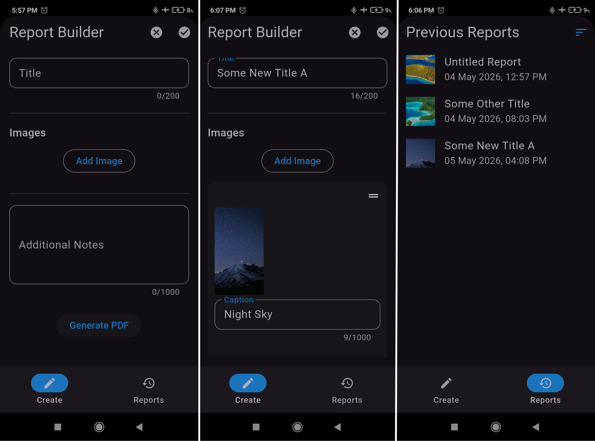
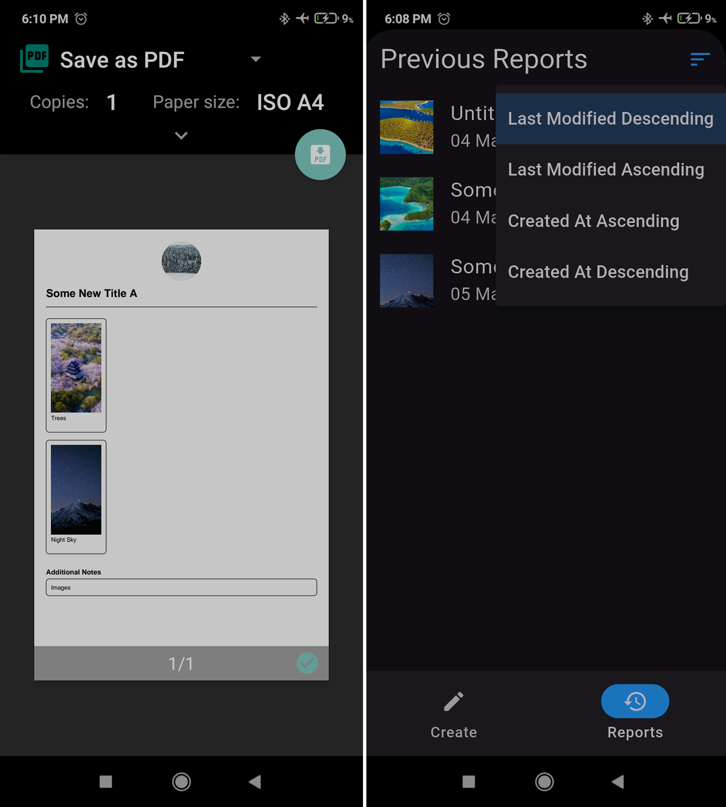

# 📄 Report Builder App (Flutter)

A simple, fast mobile app to create **clean, structured A4 PDF reports** using photos and notes.

Built for real-world use cases like inspections, site visits, and field reporting.

---

## ✨ Features

- 📸 Add 2–4 images per report  
- 📝 Add descriptions for each image  
- 🧾 Add a final summary/comment section  
- 📄 Generate clean, print-ready **A4 PDF reports**  
- 📤 Share or download generated PDFs  
- ♻️ Duplicate reports for quick reuse  
- ✏️ Edit existing reports  
- 🗂️ View and manage previous reports  
- 🔀 Reorder images inside a report  
- 🔎 Sort reports for easier access  

---

## 🎯 Use Cases

This app is designed for:

- Field inspections  
- Site visits  
- Freelancers / consultants  
- Internal company reporting  
- Any workflow requiring quick, structured PDF output  

---

## 📱 Demo

https://youtu.be/QSjceXAD2Yw

---

## 🖼️ Screenshots

### Create • Filled Report • Reports

 

### PDF Preview • Sorting



---

## 🧠 Key Focus

This project focuses on:

- Fast report creation workflow  
- Clean PDF layout generation  
- Simple and predictable user experience  
- Reusable report structure  

---

## 🛠️ Tech Stack

- Flutter  
- Dart  
- Local storage (for saved reports)  
- PDF generation  

---

---

## 🤖 Android Notes

If exporting/downloading PDFs does not work on older Android versions, make sure this permission is added in:

`android/app/src/main/AndroidManifest.xml`

```xml
<uses-permission android:name="android.permission.WRITE_EXTERNAL_STORAGE"/>
```
---

## 💡 Future Improvements

- Logo & branding options  
- Profile auto-fill (sender/company details)  
- Customizable PDF templates  
- Cloud backup / sync  

---

## 🤝 Why I Built This

Many reporting workflows are still manual, slow, or inconsistent.

This app explores a **simple, mobile-first approach** to:
- capture data quickly  
- structure it clearly  
- generate professional reports instantly  

---

## 📬 Feedback

Have suggestions or found an issue?

👉 Open an issue on this repository

---

## ⭐️ Support

If you find this useful, consider giving it a star ⭐